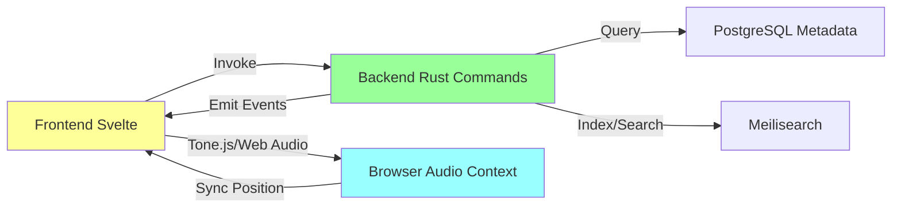

# MIDI Software Center Rebuild Plan

## Executive Summary
The current codebase provides a basic UI structure using Svelte/Tauri but lacks full functionality. Frontend components (DAWWindow, MixerWindow, etc.) exist and use stores for state management, but API calls to backend commands often fail or use mock data. The Rust backend has MIDI hardware support and a sequencer engine, but audio playback is hardware-oriented rather than web-audio based. No integration with Tone.js, Web Audio API, or Meilisearch is present. The rebuild will focus on making all components functional with real data flow from import to playback.

## Current Codebase Analysis
### Frontend (app/src)
- **Components**: DAWWindow.svelte has transport controls calling playbackActions.play() which invokes api.sequencer.start(), but no real audio. Track list shows mock tracks. MixerWindow has sliders calling setChannelVolume but no Web Audio nodes. DatabaseWindow searches via api.search.files but results are empty without DB. PipelineWindow listens for events but backend progress is unimplemented.
- **Stores**: playbackStore handles state but updates are local/mock. databaseStore calls api.search but no Meilisearch.
- **Issues**: No Tone.js/Web Audio integration; relies on Rust for playback (hardware MIDI only). UI renders but interactions fail silently.

### Backend (daw/src-tauri/src)
- **main.rs**: Sets up Tauri, manages DB pool (PostgreSQL), MIDI manager, sequencer engine. Registers commands for MIDI, sequencer, search, etc.
- **commands/**: sequencer.rs has start/stop/pause but engine uses custom scheduler for MIDI output, not JS audio. add_track loads MIDI files from DB but events are hardware-sent. No Web Audio bridge.
- **sequencer/engine.rs**: Custom tick-based playback with scheduler, but no real-time JS events for frontend sync. MIDI panic on stop works for hardware.
- **Issues**: Backend focused on hardware MIDI output; no commands for web audio synthesis. DB queries work if connected, but search lacks Meilisearch. Pipeline commands missing.

### Key Gaps
- Audio: Hardware MIDI only; need frontend Web Audio/Tone.js for browser playback.
- Search: SQL-based; need Meilisearch for fast filtering.
- Pipeline: No batch import/analysis commands.
- Integration: No real-time events from Rust to Svelte for position/VU meters.
- Testing: No end-to-end flow; DB optional (falls back to no features).

## Proposed Architecture
### Tech Stack
- **Frontend**: Svelte 4.2 + TS + Tailwind + Tone.js (playback) + Web Audio API (mixer) + Meilisearch JS client.
- **Backend**: Rust/Tauri 2.7 + PostgreSQL (metadata) + Meilisearch (search index).
- **Data Flow**: MIDI Import (Rust parses/files to DB/Meilisearch) → Search/Filter (Meilisearch) → Load to DAW (events to Tone.js) → Playback/Mix (Web Audio) → Export (Rust MIDI writer).

### Backend Tauri Commands (Enhanced)
- **DAW**: Existing sequencer commands + new: emit_position_update (real-time ticks), load_midi_to_js (serialize events for Tone.js).
- **Mixer**: New: create_audio_graph (setup Web Audio nodes via invoke), update_gain_pan (control nodes), get_vu_levels (analyser data).
- **Database**: search_files (Meilisearch query), get_file_events (MIDI events as JSON for frontend).
- **Pipeline**: import_directory (parse batch MIDI, insert DB/Meilisearch, emit progress), analyze_batch (BPM/key detection), archive_files (organize).

### Frontend Components & Integration
- **DAWWindow**: Use Tone.Transport for playback; subscribe to Rust events for sync.
- **MixerWindow**: Web Audio nodes per track; connect to Tone.js output.
- **DatabaseWindow**: Meilisearch client for search; double-click loads events to Tone.Part.
- **PipelineWindow**: Invoke import; listen for progress events.

## Data Flow Diagram
```mermaid
graph TD
    A[User Drops MIDI Files] --> B[Pipeline: Rust Parse & DB Insert]
    B --> C[Meilisearch Index Update]
    C --> D[Database Browser: Search/Filter]
    D --> E[Load to DAW: Events to Tone.js]
    E --> F[Transport: Tone.Transport.start()]
    F --> G[Mixer: Web Audio Nodes Control Volume/Pan]
    G --> H[Playback: Real-time Position/VU Updates]
    H --> I[Export: Rust MIDI Writer]
    style A fill:#f9f
    style I fill:#bbf
```

## Component Interaction Diagram


## Detailed Todo List
- [x] Analyze current codebase structure and identify broken components by reviewing key files in app/src and daw/src-tauri/src
- [-] Define detailed architecture for backend Tauri commands required for DAW, Mixer, Database Browser, and Pipeline functionality
  - Implement real-time event emission for position/VU
  - Add Meilisearch integration commands
  - Create Web Audio bridge commands
- [-] Outline frontend Svelte components and their data flow integration with Rust backend and external libraries like Tone.js and Web Audio API
  - Integrate Tone.js in DAW for sequencer
  - Setup Web Audio mixer graph
  - Use Meilisearch JS client in Database
- [-] Plan database schema updates and Meilisearch index setup for real MIDI metadata handling
  - Add BPM/key/tags fields if missing
  - Script for indexing existing files
- [-] Create implementation plan for transport controls and real-time playback in DAW window using Tone.js
  - Map Rust events to Tone.Transport
  - Handle loop/metronome in JS
- [-] Design audio routing and control system for Mixer window with volume, pan, and VU meters
  - Create Gain/PannerNode per track
  - AnalyserNode for meters
- [-] Specify search and filter logic for Database Browser with Meilisearch integration
  - Define searchable fields (name, BPM, key, tags)
  - Facet filters for BPM range/key
- [-] Detail batch processing workflow for Pipeline including import, analysis, and archiving with progress tracking
  - Rust async tasks with channels for progress
  - BPM/key detection library integration
- [-] Plan integration testing strategy for all components including end-to-end data flow from import to playback
  - Unit tests for commands/stores
  - E2E: Import → Search → Load → Play → Mix
- [-] Document deployment and verification steps to ensure full functionality post-rebuild
  - Setup scripts for DB/Meilisearch
  - Browser testing checklist

## Next Steps
Review this plan. If approved, switch to code mode for implementation starting with backend enhancements.